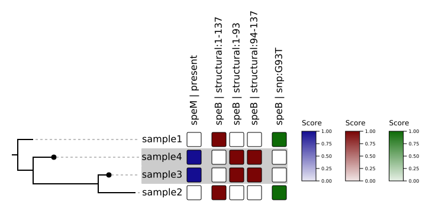

# panGWAS

[](#credits)
[](https://github.com/phac-nml/pangwas/blob/master/LICENSE)
[](https://github.com/phac-nml/pangwas/issues)
[](https://github.com/phac-nml/pangwas/actions/workflows/test.yaml)


**panGWAS** is a pipeline for pangenome wide association studies. It reconstructs a pangenome from genomic assemblies, performs annotation and variant calling, estimates population structure, and models the association between genomic variants and variables of interest.


**panGWAS** is implemented as a `python` package and CLI tool, that can be run on any POSIX-based system (Linux, Mac). We additionally provide a `nextflow` pipeline for end-to-end analysis.

Please see the extended documentation at: <https://phac-nml.github.io/pangwas/>

## Why panGWAS?

**panGWAS** is distinct from other pangenome/GWAS workflows because it:

1. Provides end-to-end analysis, from genomic assemblies to GWAS results.
1. Includes both coding and non-coding sequences in the pangenome.
1. Ensures reproducible, deterministic results.
1. Offers both sensible defaults and extensive customization of underlying tools.
1. Keeps variants tightly linked to their annotations for easier interpretation at each stage.

## Method

**panGWAS** performs the following analyses:

1. **Annotate**: Standardized annotation of genomes<sup>*</sup> with [`bakta`](https://github.com/oschwengers/bakta).
1. **Cluster**: Identify genomic regions with shared homology using [`MMseqs2`](https://github.com/soedinglab/mmseqs2).
1. **Align**: Concatenate and align clusters with [`mafft`](https://mafft.cbrc.jp/).
1. **Variants**: SNPs, presence absence, and structural variants.
1. **Tree**: Estimate a maximum-likelihood tree with [`IQ-TREE`](http://www.iqtree.org/).
1. **GWAS**: Model the association between variants and traits with [`pyseer`](https://pyseer.readthedocs.io/en/master/index.html).
1. **Plot**: Manhattan plots, tree visualizations, heatmaps of signficant variants, QQ plots.

<sup>*</sup> For non-bacterial genomes, you will need to bring your own `gff` annotations.

## Install

### Post-Release

>❗ These instructions apply after public release.

1. Install with `conda`:

    ```bash
    conda create -c conda-forge -c bioconda -n pangwas
    ```

1. Install with `docker`/`singularity`:

    ```bash
    docker pull ghcr.io/phac-nml/pangwas:latest
    ```

### Pre-Release

>❗ These instructions apply before public release.

1. Clone repository.

    ```bash
    git clone https://github.com/phac-nml/pangwas.git
    cd pangwas
    ```

1. Install with `conda`.

    ```bash
    conda env create -y -f environment.yml -n pangwas
    conda activate pangwas
    pip install .

    # Help and usage
    pangwas --help
    nextflow run . --help
    ```

1. Install with `docker`.

    ```bash
    docker build -t phac-nml/pangwas:latest -f Dockerfile .

    # Help and usage
    docker run phac-nml/pangwas:latest pangwas --help
    docker run phac-nml/pangwas:latest nextflow run . --help
    ```

## Usage

Individual commands can be run via the command-line interface:

```bash
pangwas extract --gff sample1.gff3
pangwas extract --gff sample2.gff3
pangwas collect --tsv sample1.tsv sample2.tsv
pangwas cluster --fasta sequences.fasta
...
```

Or as `python` functions:

```python
import pangwas

pangwas.extract(gff="sample1.gff3")
pangwas.extract(gff="sample2.gff3")
pangwas.collect(tsv=["sample1.tsv", "sample2.tsv"])
pangwas.cluster(fasta="sequences.fasta")
...
```

For a detailed guide on each command please see the [Manual](https://phac-nml.github.io/pangwas/manual/table_of_contents.html).

### Nextflow

An end-to-end pipeline is provided via `nextflow`. We provide a minimal `test` profile of synthetic data that runs quickly:

```bash
nextflow run phac-nml/pangwas -profile test --trait resistant
```

The samples `sample4` and `sample3` are the ones that are labelled as "resistant" and we can see the following variants are significantly associated with this trait:



We also provide tutorials profile that runs the dataset from the [`pyseer` GWAS tutorial](https://pyseer.readthedocs.io/en/master/tutorial.html). It demonstrates how to use pre-computed variants and tree, and only runs the GWAS and PLOT stages:

```bash
# Core genome GWAS
gunzip data/tutorial_core/snps.Rtab.gz
nextflow run phac-nml/pangwas -profile tutorial_core --trait penicillin

# Pangenome GWAS
gunzip data/tutorial_pangenome/variants.Rtab.gz
gunzip data/tutorial_pangenome/clusters.tsv.gz
nextflow run phac-nml/pangwas -profile tutorial_pangenome --trait penicillin
```

Penicillin resistance is primarily controlled by core genome genes, and we can see that the major genes are identical between a pangenome and core genome GWAS.


For more information on end-to-end analysis, please see the [Pipeline Documentation](https://phac-nml.github.io/pangwas/pipeline/pipeline.html).

## Credits

[panGWAS](https://github.com/phac-nml/pangwas) is built and maintained by [Katherine Eaton](https://ktmeaton.github.io/) at the [National Microbiology Laboratory (NML)](https://github.com/phac-nml) of the Public Health Agency of Canada (PHAC).

If you have any questions, please email katherine.eaton@phac-aspc.gc.ca.

<table>
  <tr>
    <td align="center"><a href="https://ktmeaton.github.io"><br /><sub><b>Katherine Eaton</b></sub></a><br /><a href="https://github.com/phac-nml/pangwas/commits?author=ktmeaton" title="Code">💻</a> <a href="https://github.com/phac-nml/pangwas/commits?author=ktmeaton" title="Documentation">📖</a> <a href="#design-ktmeaton" title="Design">🎨</a> <a href="#ideas-ktmeaton" title="Ideas, Planning, & Feedback">🤔</a> <a href="#infra-ktmeaton" title="Infrastructure (Hosting, Build-Tools, etc)">🚇</a> <a href="#maintenance-ktmeaton" title="Maintenance">🚧</a></td>
  </tr>
</table>

This project follows the [all-contributors](https://github.com/all-contributors/all-contributors) specification ([emoji key](https://allcontributors.org/docs/en/emoji-key)). Contributions of any kind welcome!

Special thanks go to the developers of [PPanGGOLiN](https://github.com/labgem/PPanGGOLiN). The **Cluster** and **Align** steps are heavily inspired by [PPanGGOLiN](https://github.com/labgem/PPanGGOLiN), and in fact, **panGWAS** uses a modified version of PPanGGOLiN's defragmentation algorithm.

<table>
  <tr>
    <td align="center">
      <a href="https://github.com/ggautreau">
        <br />
        <sub><b>Guillaume Gautreau</b></sub>
      </a>
      <br />
      <a href="https://github.com/labgem/PPanGGOLiN" title="Design: PPanGGOLiN">🎨</a>
      <a href="https://github.com/labgem/PPanGGOLiN" title="Ideas: PPanGGOLiN">🤔</a>
    </td>
    <td align="center">
      <a href="https://github.com/JeanMainguy">
        <br />
        <sub><b>Jean Mainguy</b></sub>
      </a>
      <br />
      <a href="https://github.com/labgem/PPanGGOLiN" title="Design: PPanGGOLiN">🎨</a>
      <a href="https://github.com/labgem/PPanGGOLiN" title="Ideas: PPanGGOLiN">🤔</a>
    </td>    
    <td align="center">
      <a href="https://github.com/jpjarnoux">
        <br />
        <sub><b>Jérôme Arnoux</b></sub>
      </a>
      <br />
      <a href="https://github.com/labgem/PPanGGOLiN" title="Design: PPanGGOLiN">🎨</a>
      <a href="https://github.com/labgem/PPanGGOLiN" title="Ideas: PPanGGOLiN">🤔</a>
    </td>
    <td align="center">
      <a href="https://github.com/axbazin">
        <br />
        <sub><b>Jérôme Arnoux</b></sub>
      </a>
      <br />
      <a href="https://github.com/labgem/PPanGGOLiN" title="Design: PPanGGOLiN">🎨</a>
      <a href="https://github.com/labgem/PPanGGOLiN" title="Ideas: PPanGGOLiN">🤔</a>
    </td>
  </tr>
</table>

Thanks go to the following people, who participated in the development of **panGWAS**:

<table>
  <tr>
    <td align="center">
      <a href="https://github.com/phac-nml">
        <br />
        <sub><b>Irene Martin</b></sub>
      </a>
      <br />
      <a href="https://github.com/phac-nml" title="Design: GWAS">🎨</a>      
      <a href="https://github.com/phac-nml" title="Data: iGAS">🔣</a>
    </td>
    <td align="center">
      <a href="https://github.com/phac-nml">
        <br />
        <sub><b>Alyssa Golden</b></sub>
      </a>
      <br />
      <a href="https://github.com/phac-nml" title="Design: GWAS">🎨</a>      
      <a href="https://github.com/phac-nml" title="Data: iGAS">🔣</a>
    </td>  
    <td align="center">
      <a href="https://github.com/
ShelleyPeterson">
        <br />
        <sub><b>Shelley Peterson</b></sub>
      </a>
      <br />
      <a href="https://github.com/phac-nml" title="Design: GWAS">🎨</a>      
      <a href="https://github.com/ShelleyPeterson" title="Data: iGAS">🔣</a>
    </td>
    <td align="center">
      <a href="https://github.com/phac-nml">
        <br />
        <sub><b>Natalie Knox</b></sub>
      </a>
      <br />
      <a href="https://github.com/phac-nml" title="Design: GWAS">🎨</a>
    </td>
    <td align="center">
      <a href="https://github.com/phac-nml">
        <br />
        <sub><b>Andrea Tyler</b></sub>
      </a>
      <br />
      <a href="https://github.com/phac-nml" title="Design: GWAS">🎨</a>
    </td>
  </tr>
</table>

## License

Copyright 2025 Government of Canada

Licensed under the Apache License, Version 2.0 (the "License"); you may not use this work except in compliance with the License. You may obtain a copy of the License at:

http://www.apache.org/licenses/LICENSE-2.0

Unless required by applicable law or agreed to in writing, software distributed under the License is distributed on an "AS IS" BASIS, WITHOUT WARRANTIES OR CONDITIONS OF ANY KIND, either express or implied. See the License for the specific language governing permissions and limitations under the License.
