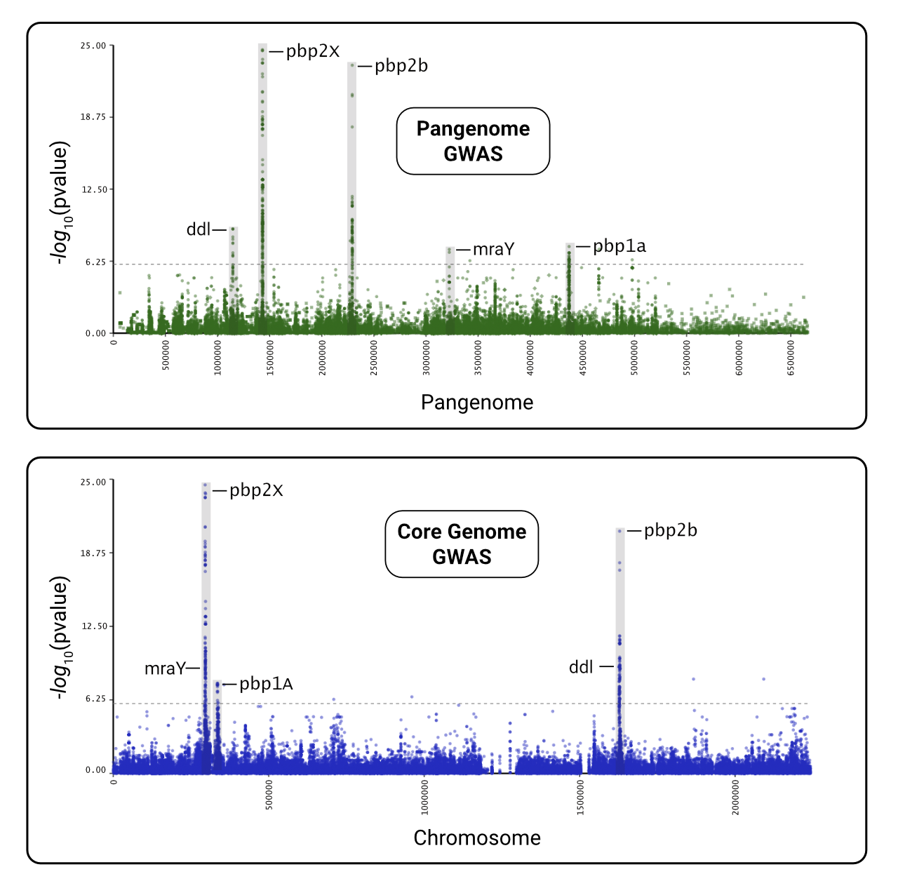

# panGWAS

[](#credits)
[](https://github.com/phac-nml/pangwas/blob/master/LICENSE)
[](https://github.com/phac-nml/pangwas/issues)
[](https://github.com/phac-nml/pangwas/actions/workflows/test.yaml)

**panGWAS** is a pipeline for pangenome wide association studies. It reconstructs a pangenome from genomic assemblies, performs annotation and variant calling, estimates population structure, and models the association between genomic variants and variables of interest.


**panGWAS** is implemented as a `python` package and CLI tool, that can be run on any POSIX-based system (Linux, Mac). We additionally provide a `nextflow` pipeline for end-to-end analysis.

Please see the extended documentation at: <https://phac-nml.github.io/pangwas/>

## Table of Contents

1. [Why panGWAS?](#why-pangwas)
1. [Method](#method)
1. [Install](#install)
1. [Usage](#usage)
1. [Output](#output)
1. [Credits](#credits)

## Why panGWAS?

**panGWAS** is distinct from other pangenome/GWAS workflows because it:

1. Provides end-to-end analysis, from genomic assemblies to GWAS results.
1. Includes both coding and non-coding sequences in the pangenome.
1. Ensures reproducible, deterministic results.
1. Offers both sensible defaults and extensive customization of underlying tools.
1. Keeps variants tightly linked to their annotations for easier interpretation at each stage.

## Method

**panGWAS** performs the following analyses:

1. **Annotate**: Standardized annotation of genomes<sup>*</sup> with [`bakta`](https://github.com/oschwengers/bakta).
1. **Cluster**: Identify genomic regions with shared homology using [`MMseqs2`](https://github.com/soedinglab/mmseqs2).
1. **Align**: Concatenate and align clusters with [`mafft`](https://mafft.cbrc.jp/).
1. **Variants**: SNPs, presence absence, and structural variants.
1. **Tree**: Estimate a maximum-likelihood tree with [`IQ-TREE`](http://www.iqtree.org/).
1. **GWAS**: Model the association between variants and traits with [`pyseer`](https://pyseer.readthedocs.io/en/master/index.html).
1. **Plot**: Manhattan plots, tree visualizations, heatmaps of signficant variants, QQ plots.

<sup>*</sup> For non-bacterial genomes, you will need to bring your own `gff` annotations.

## Install

### Conda

> ❗ Pending release of the [bioconda recipe](https://github.com/bioconda/bioconda-recipes/pull/54760).

```bash
conda create -n pangwas -c conda-forge -c bioconda pangwas
```

### Docker

> ❗ Pending release of the [bioconda recipe](https://github.com/bioconda/bioconda-recipes/pull/54760).

```bash
docker pull quay.io/biocontainers/pangwas:latest
```

### Nextflow

```bash
nextflow pull phac-nml/pangwas
```

### Source

Install `pangwas` from the github repository:

```bash
micromamba env create -f environment.yml -n pangwas
micromamba activate pangwas
pip install .
```

Build the `Docker` image from the github repository:

```bash
docker build -t phac-nml/pangwas:latest .
```

## Usage

> For more information, please see the [Manual](https://phac-nml.github.io/pangwas/manual/table_of_contents.html) and [Pipeline Documentation](https://phac-nml.github.io/pangwas/pipeline/pipeline.html).

### CLI

Individual commands can be run via the command-line interface:

```bash
pangwas extract --gff sample1.gff3
pangwas extract --gff sample2.gff3
pangwas collect --tsv sample1.tsv sample2.tsv
pangwas cluster --fasta sequences.fasta
...
```

For an end-to-end example using the CLI, please see the [Command-Line Interface](https://phac-nml.github.io/pangwas/pipeline/pipeline.html#command-line-interface) example.

### Python

Individual commands can be run as `python` functions:

```python
import pangwas

pangwas.extract(gff="sample1.gff3")
pangwas.extract(gff="sample2.gff3")
pangwas.collect(tsv=["sample1.tsv", "sample2.tsv"])
pangwas.cluster(fasta="sequences.fasta")
...
```

For an end-to-end example using python, please see the [Python Package](https://phac-nml.github.io/pangwas/pipeline/pipeline.html#python-package) example.

### Nextflow

An end-to-end pipeline is provided via `nextflow`:

```bash
nextflow run phac-nml/pangwas -profile test
```

For more examples, please see the [tutorials](https://phac-nml.github.io/pangwas/tutorials/tutorials.html). We recommend the [Pyseer tutorial](https://phac-nml.github.io/pangwas/tutorials/03_pyseer_tutorial.html), which automates and reproduces the results from the [penicillin resistance GWAS](https://pyseer.readthedocs.io/en/master/tutorial.html) created by the `pyseer` authors:



## Output

1. **Plots**: PNG and SVG files under the `manhattan` and `heatmap` directories.

    > ❗**Tip**: Open the SVG in Edge or Firefox, to get hovertext!

    | Manhattan | Heatmap | QQ Plot |
    | ----------| ------- | ------- |
    |        |      |      |


1. **GWAS Tables**: Statistic results per variant.

    |variant        |af      |filter-pvalue|lrt-pvalue|beta    |beta-std-err|variant_h2|notes|-log10(p)         |bonferroni           |...|
    |:--------------|:-------|:------------|:---------|:-------|:-----------|:---------|:----|:-----------------|:--------------------|:---|
    |pbpX\|snp:G761A |3.78E-01|6.12E-94     |3.01E-25  |7.42E-01|6.82E-02    |4.05E-01  |     |24.521433504406158|1.180414561594032e-06|...|
    |pbpX\|snp:T1077C|3.85E-01|1.11E-95     |1.43E-24  |7.23E-01|6.76E-02    |4.00E-01  |     |23.844663962534938|1.180414561594032e-06|...|

1. **Trees**: We recommend [Arborview](https://phac-nml.github.io/ArborView/html/table.html) for interactive visualization of the newick files!

    

1. **Pangenome**: We recommend [Bandage](https://github.com/rrwick/Bandage) for interactive visualization of the pangenome graph!

    - [GFA](https://github.com/GFA-spec/GFA-spec) files can be found under `summarize` for both the full and linearized version of the pangenome.

    

And much more!

## Credits

[panGWAS](https://github.com/phac-nml/pangwas) is built and maintained by [Katherine Eaton](https://ktmeaton.github.io/) at the [National Microbiology Laboratory (NML)](https://github.com/phac-nml) of the Public Health Agency of Canada (PHAC).

If you have any questions, please email ktmeaton@gmail.com.

<table>
  <tr>
    <td align="center"><a href="https://ktmeaton.github.io"><br /><sub><b>Katherine Eaton</b></sub></a><br /><a href="https://github.com/phac-nml/pangwas/commits?author=ktmeaton" title="Code">💻</a> <a href="https://github.com/phac-nml/pangwas/commits?author=ktmeaton" title="Documentation">📖</a> <a href="#design-ktmeaton" title="Design">🎨</a> <a href="#ideas-ktmeaton" title="Ideas, Planning, & Feedback">🤔</a> <a href="#infra-ktmeaton" title="Infrastructure (Hosting, Build-Tools, etc)">🚇</a> <a href="#maintenance-ktmeaton" title="Maintenance">🚧</a></td>
  </tr>
</table>

### Contributors

This project follows the [all-contributors](https://github.com/all-contributors/all-contributors) specification ([emoji key](https://allcontributors.org/docs/en/emoji-key)). Contributions of any kind welcome!

Special thanks go to the developers of [PPanGGOLiN](https://github.com/labgem/PPanGGOLiN). The **Cluster** and **Align** steps are heavily inspired by [PPanGGOLiN](https://github.com/labgem/PPanGGOLiN), and in fact, **panGWAS** uses a modified version of PPanGGOLiN's defragmentation algorithm.

<table>
  <tr>
    <td align="center">
      <a href="https://github.com/ggautreau">
        <br />
        <sub><b>Guillaume Gautreau</b></sub>
      </a>
      <br />
      <a href="https://github.com/labgem/PPanGGOLiN" title="Design: PPanGGOLiN">🎨</a>
      <a href="https://github.com/labgem/PPanGGOLiN" title="Ideas: PPanGGOLiN">🤔</a>
    </td>
    <td align="center">
      <a href="https://github.com/JeanMainguy">
        <br />
        <sub><b>Jean Mainguy</b></sub>
      </a>
      <br />
      <a href="https://github.com/labgem/PPanGGOLiN" title="Design: PPanGGOLiN">🎨</a>
      <a href="https://github.com/labgem/PPanGGOLiN" title="Ideas: PPanGGOLiN">🤔</a>
    </td>    
    <td align="center">
      <a href="https://github.com/jpjarnoux">
        <br />
        <sub><b>Jérôme Arnoux</b></sub>
      </a>
      <br />
      <a href="https://github.com/labgem/PPanGGOLiN" title="Design: PPanGGOLiN">🎨</a>
      <a href="https://github.com/labgem/PPanGGOLiN" title="Ideas: PPanGGOLiN">🤔</a>
    </td>
    <td align="center">
      <a href="https://github.com/axbazin">
        <br />
        <sub><b>Jérôme Arnoux</b></sub>
      </a>
      <br />
      <a href="https://github.com/labgem/PPanGGOLiN" title="Design: PPanGGOLiN">🎨</a>
      <a href="https://github.com/labgem/PPanGGOLiN" title="Ideas: PPanGGOLiN">🤔</a>
    </td>
  </tr>
</table>

Thanks go to the following people, who participated in the development of **panGWAS**:

<table>
  <tr>
    <td align="center">
      <a href="https://github.com/phac-nml">
        <br />
        <sub><b>Irene Martin</b></sub>
      </a>
      <br />
      <a href="https://github.com/phac-nml" title="Ideas: GWAS">🤔</a>
      <a href="https://github.com/phac-nml" title="Data: iGAS">🔣</a>
    </td>
    <td align="center">
      <a href="https://github.com/phac-nml">
        <br />
        <sub><b>Alyssa Golden</b></sub>
      </a>
      <br />
      <a href="https://github.com/phac-nml" title="Ideas: GWAS">🤔</a>
      <a href="https://github.com/phac-nml" title="Data: iGAS">🔣</a>
    </td>  
    <td align="center">
      <a href="https://github.com/
ShelleyPeterson">
        <br />
        <sub><b>Shelley Peterson</b></sub>
      </a>
      <br />
      <a href="https://github.com/phac-nml" title="Ideas: GWAS">🤔</a>
      <a href="https://github.com/ShelleyPeterson" title="Data: iGAS">🔣</a>
    </td>
    <td align="center">
      <a href="https://github.com/phac-nml">
        <br />
        <sub><b>Natalie Knox</b></sub>
      </a>
      <br />
      <a href="https://github.com/phac-nml" title="Ideas: GWAS">🤔</a>
    </td>
    <td align="center">
      <a href="https://github.com/phac-nml">
        <br />
        <sub><b>Andrea Tyler</b></sub>
      </a>
      <br />
      <a href="https://github.com/phac-nml" title="Ideas: GWAS">🤔</a>
    </td>
  </tr>
  <tr>
    <td align="center">
      <a href="https://github.com/DarianHole">
        <br />
        <sub><b>Darian Hole</b></sub>
      </a>
      <br/>
      <a href="https://github.com/phac-nml" title="Review: Pull Request">👀</a>
      <a href="https://github.com/DarianHole" title="Testing">⚠️</a>
      <a href="https://github.com/DarianHole" title="Security">🛡️</a>
    </td>
    <td align="center">
      <a href="https://github.com/ConnorChato">
        <br />
        <sub><b>Connor Chato</b></sub>
      </a>
      <br />
      <a href="https://github.com/ConnorChato" title="Research: Clustering">🔬</a>
      <a href="https://github.com/ConnorChato" title="Ideas: Clustering">🤔</a>
    </td>
    <td align="center">
      <a href="https://github.com/phac-nml">
        <br />
        <sub><b>Amber Papineau</b></sub>
      </a>
      <br />
      <a href="https://github.com/phac-nml" title="Data: Heatmap">🔣</a>
      <a href="https://github.com/phac-nml" title="Research: Heatmap">🔬</a>
    </td>
    <td align="center">
      <a href="https://github.com/molpratt">
        <br />
        <sub><b>Molly Pratt</b></sub>
      </a>
      <br />
      <a href="https://github.com/molpratt" title="Design: Workflow Flowchart">🎨</a>
    </td>
    <td align="center">
      <a href="https://github.com/KirstenPalmier">
        <br />
        <sub><b>Kirsten Palmier</b></sub>
      </a>
      <br />
      <a href="https://github.com/KirstenPalmier" title="Literature Review, Research: GWAS">🔬</a>
    </td>
  </tr>
    <td align="center">
      <a href="https://github.com/TheZetner">
        <br />
        <sub><b>Adrian Azetner</b></sub>
      </a>
      <br />
      <a href="https://github.com/TheZetner" title="Ideas: Plots">🤔</a>
    </td>  
    <td align="center">
      <a href="https://github.com/phac-nml">
        <br />
        <sub><b>Ana Duggan</b></sub>
      </a>
      <br />
      <a href="https://github.com/phac-nml" title="Ideas: Trees">🤔</a>
      <a href="https://github.com/phac-nml" title="Review: Pull Request">👀</a>
      <a href="https://github.com/phac-nml" title="Project Management">📆</a>
    </td>
    <td align="center">
      <a href="https://github.com/GH-Emily">
        <br />
        <sub><b>Emily Haverhold</b></sub>
      </a>
      <br />
      <a href="https://github.com/GH-Emily" title="Project Management">📆</a>
    </td>    
  <tr>

  </tr>
</table>

## License

Copyright 2025 Government of Canada

Licensed under the Apache License, Version 2.0 (the "License"); you may not use this work except in compliance with the License. You may obtain a copy of the License at:

http://www.apache.org/licenses/LICENSE-2.0

Unless required by applicable law or agreed to in writing, software distributed under the License is distributed on an "AS IS" BASIS, WITHOUT WARRANTIES OR CONDITIONS OF ANY KIND, either express or implied. See the License for the specific language governing permissions and limitations under the License.
