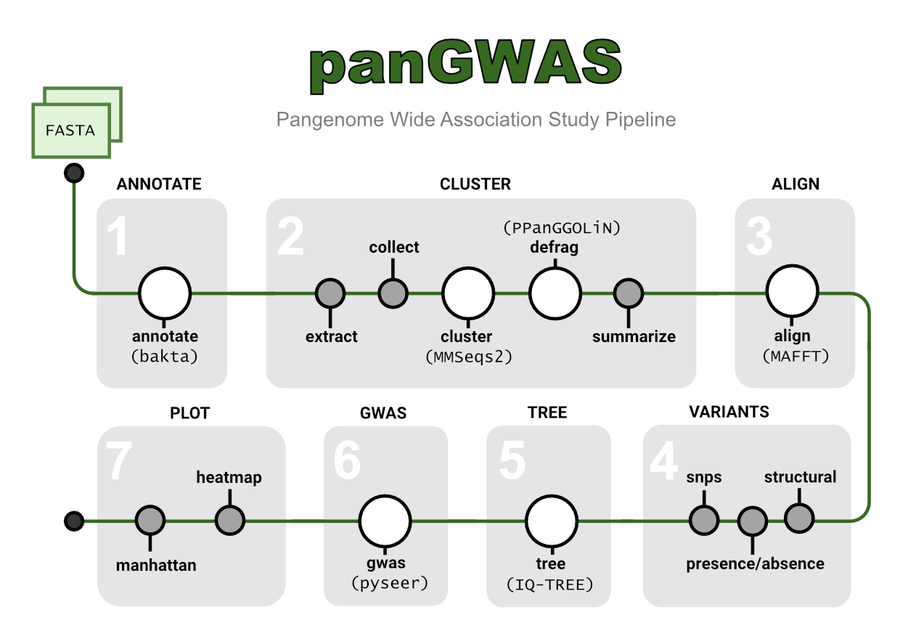

# Manual

## Annotate

1. [annotate](annotate.html): Annotate genomic assemblies with bakta.

## Cluster

1. [extract](extract.html): Extract sequences and annotations from GFF files.
1. [collect](collect.html): Collect extracted sequences from multiple samples into one file.
1. [cluster](cluster.html): Cluster nucleotide sequences with mmseqs.
1. [defrag](defrag.html): Defrag clusters by associating fragments with their parent cluster.
1. [summarize](summarize.html): Summarize clusters according to their annotations.

## Align

1. [align](align.html): Align clusters using mafft and create a pangenome alignment.

## Variants

1. [structural](structural.html): Extract structural variants from cluster alignments.
1. [snps](snps.html): Extract SNPs from a pangenome alignment.
1. [presence_absence](snps.html): Extract presence absence of clusters.

## Tree

1. [tree](tree.html): Estimate a maximum-likelihood tree with IQ-TREE.

## GWAS

1. [gwas](gwas.html): Run genome-wide association study (GWAS) tests with pyseer.

## Plot

1. [manhattan](manhattan.html):  Plot the distribution of variant p-values across the genome.
1. [heatmap](heatmap.html): Plot a heatmap of variants alongside a tree.

## Utility

1. [root_tree](root_tree.html): Root tree on outgroup taxa.
1. [binarize](binarize.html): Convert a categorical column to multiple binary (0/1) columns.
1. [table_to_rtab](table_to_rtab): Convert a TSV/CSV table to an Rtab file based on regex filters.
1. [vcf_to_rtab](vcf_to_rtab): Convert a VCF file to an Rtab file.

## Overview

