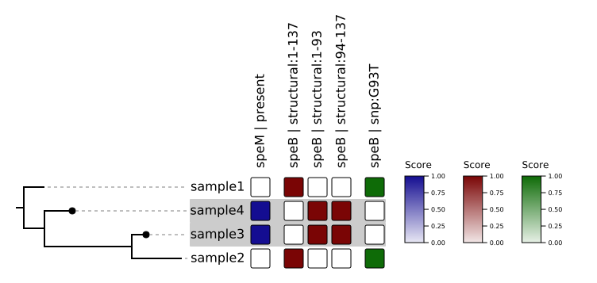

# Tutorial 01 - Test

This tutorial demonstrates the use of **panGWAS** on a tiny, synthetic dataset.

1. Run the test data through a GWAS on the trait `resistant`.

    ```bash
    nextflow run phac-nml/pangwas -profile test --trait resistant
    ```

The samples `sample4` and `sample3` are the ones that are labelled as "resistant" and we can see the following variants are significantly associated with this trait:

- Heatmap: `results/test/heatmap/resistant/resistant.plot.svg`


