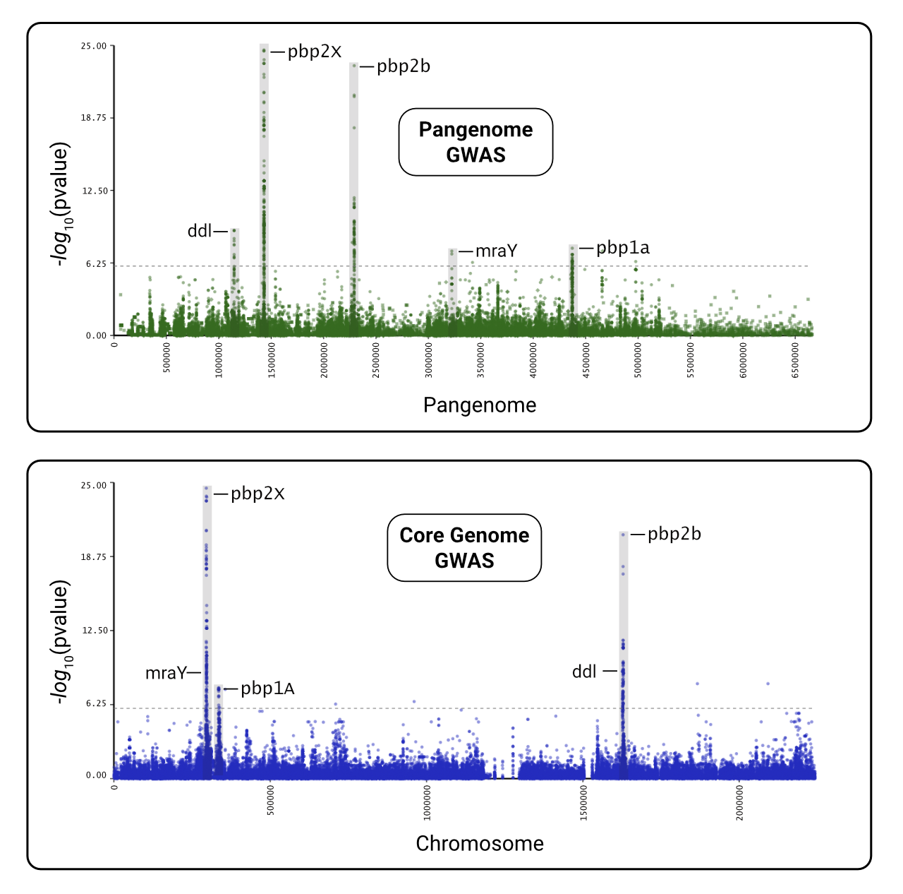

# Tutorial 03 - Pyseer Tutorial

1. Download the tutorial data.

    ```bash
    nextflow pull phac-nml/pangwas
    cp -r ~/.nextflow/assets/phac-nml/pangwas/data .
    ```

1. Decompress the data.

    ```bash
    gunzip data/tutorial_core/snps.Rtab.gz
    gunzip data/tutorial_pangenome/variants.Rtab.gz
    gunzip data/tutorial_pangenome/clusters.tsv.gz
    ```

1. Run the core genome GWAS.

    ```bash
    nextflow run phac-nml/pangwas -profile tutorial_core --trait penicillin
    ```

1. Run the pangenome GWAS.

    ```bash
    nextflow run phac-nml/pangwas -profile tutorial_pangenome --trait penicillin
    ```

Penicillin resistance is primarily controlled by core genome genes, and we can see that the major genes are identical between a pangenome and core genome GWAS.


